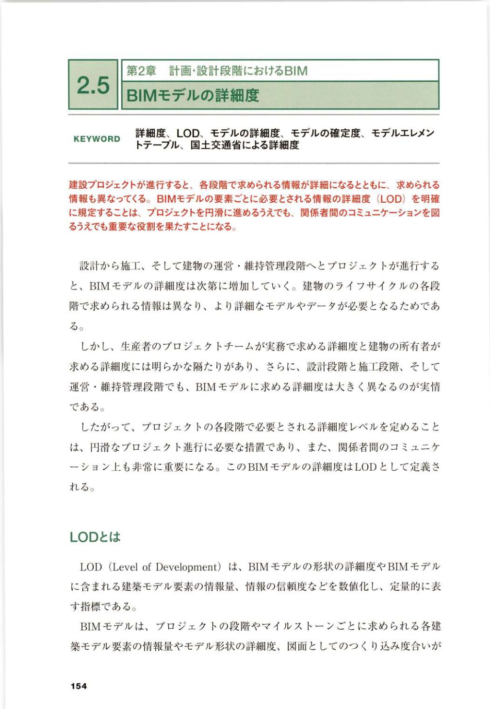

# 第10章 演習問題 / Chapter 10 Exercises

> **対応章：** [第10章](../textbook/chap10.md)
>
> **解答：** [chap10_answers.md](chap10_answers.md)

---

### 問1：概念確認（多肢選択式）/ Concept Check (Multiple Choice)

以下の各問から最も適切な選択肢を1つ選べ（各2点、合計20点）。

1. BIM の略称として正しいものはどれか？
   - A. Building Information Modeling
   - B. Building Infrastructure Management
   - C. Basic Information Methodology
   - D. Built-in Integrated Modeling

2. IFC規格を策定している機関として正しいのはどれか？
   - A. ISO/TC 59
   - B. buildingSMART International
   - C. ASHRAE
   - D. JIS委員会

3. LOD 400 が示す詳細度として正しいのはどれか？
   - A. 概念設計段階
   - B. 基本設計段階
   - C. 施工詳細設計段階（製作・施工情報含む）
   - D. 維持管理段階

4. CDEの「Shared」状態とはどのような状態か？
   - A. 作業中の未完成データ
   - B. チームに共有・レビュー可能な状態
   - C. 正式承認・発行済みの状態
   - D. アーカイブ済みの状態

5. BEP（BIM実行計画書）に含まれるべき内容として不適切なのはどれか？
   - A. 使用BIMソフトウェアとバージョン
   - B. プロジェクト関係者の個人的な趣味
   - C. LOD要件
   - D. ファイル命名規則

---

### 問2：図表読解 / Figure Interpretation

以下の図表（出典：PDF p.150）を参照し、設問に答えよ。

【図表：AI×BIMの設計自動化概念図（Generative Design）】
（出典：PDF p.150）

**(a)** この図表が示す主要なメッセージを1文で述べよ。

**(b)** この図表を自分のプロジェクトに適用する場合、どのような示唆が得られるか。

**(c)** この図表が示す課題または制限事項を1つ挙げよ。

---

### 問3：ケーススタディ / Case Study Scenario

以下のシナリオを読み、設問に答えよ（各10点）。

**シナリオ：**
東京都内の10階建てオフィスビルの新築プロジェクトにおいて、
意匠設計事務所（Revit使用）、構造設計事務所（Tekla使用）、
設備設計事務所（Revit MEP使用）が参加している。
プロジェクトの開始1ヶ月後、各社が独自にBIMモデルを作成しているが、
ファイル形式・座標系・LOD要件が統一されていないことが判明した。

**(a)** この状況で発生しうる具体的なリスクを3つ列挙せよ。

**(b)** この問題を解決するために、プロジェクトマネージャーとして今すぐ実施すべきアクションを優先順位順に述べよ。

**(c)** この状況を未然に防ぐために、プロジェクト開始前に策定すべきであった文書・手順を2つ挙げ、その内容を説明せよ。

---

### 問4：BIM意思決定演習 / BIM Decision-Making Exercise

あなたは中規模設計事務所（社員30名）のBIM推進担当者である。
経営陣から「来期中にBIMを全社導入せよ」との指示が出た。

**(a)** 段階的BIM導入計画（3ヶ年計画）の骨子を作成せよ。

**(b)** BIM導入にあたって想定される社内抵抗要因を3つ挙げ、それぞれの対処策を述べよ。

**(c)** BIM導入のROI（投資対効果）を経営陣に説明する際の主要指標を3つ挙げ、計算方法を概説せよ。

---

### 問5：戦略的思考問題 / Strategic Thinking

「日本の建設業界におけるBIM普及の最大の障壁は何か、
そしてそれをどのように克服できるか」について、
第10章の内容を踏まえ500字以内で論述せよ。

論述には以下の要素を含めること：
- 技術的障壁と制度的障壁の両面からの分析
- 日本固有の建設文化的背景の考慮
- 具体的な克服策（短期・中期・長期）

---

🔘 Translate this exercises to English

[English translation placeholder – AI translatable block]
